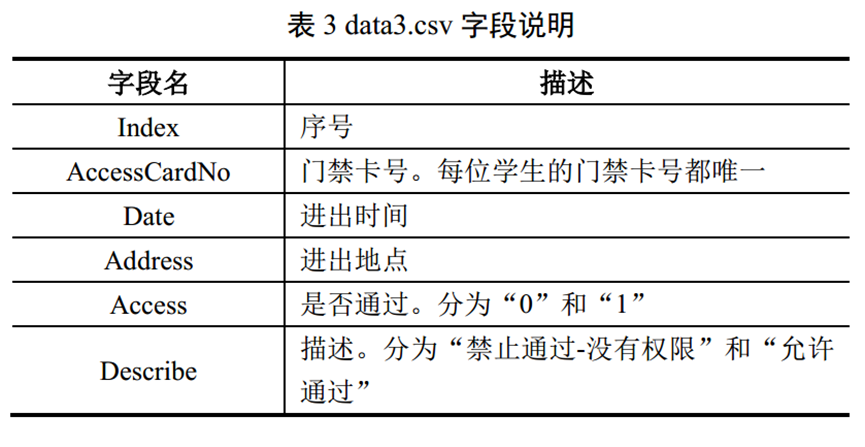

## Data Visualization System

### 环境配置

> 1.安装git、nodejs、WebStorm

> 2.克隆项目

> 3.安装MySQL并配置数据库，数据在server/public/dataset，把数据导入数据库

> 4.进入控制台终端，在项目server下执行`npm install`安装依赖

> 5.进入控制台终端，在项目client下执行`npm install`安装依赖

> 6.在server目录下执行`npm start`启动服务器,在client目录下执行`npm run dev`启动客户端
>
### 数据库信息

*原始数据表*
>
> 学生信息表 --- students_origin(CardNo,Sex,Major,AccessCardNo)
>
> 消费记录表 --- cost_origin(CardNo,PeoNo,Date,Money,FundMoney,Surplus,CardCount,Type,TermNo,OperNo,Dept)
>
> 消费记录表Plus --- cost_pro(CardNo,Sex,Major,Date,Money,FundMoney,Surplus,CardCount,Type,TermNo,OperNo,Dept)
>
> 门禁记录表 --- access_origin(AccessCardNo,Date,Address,Access)
>
>
```
//数据查询示例
mounted(){
    this.init();
},
methods:{
    init(){
        this.$http('query',{params:{
            sql:`select * from students` //SQL查询语句
        }}).then(res=>{
            console.log(res.body); //响应数据
        });
    }
}
```




### 分析任务
（1）分析不同专业、不同性别学生消费行为特点与时空偏好；
- 行为特点（消费综合情况）早/中/晚/日/周/月/周末
- 时空偏好（就餐时间和地点）/超市/食堂/Other/时变趋势

性别地点偏好对比  建议用雷达图[Echarts示例](https://gallery.echartsjs.com/editor.html?c=xry6q2gGS7)
```
        this.$http.get('query', {
          params: {
            sql: `select Sex,Dept from cost_pro`
          }
        }).then(res=>{
          let data = d3.nest().key(d=>d.Sex).entries(res.body).filter(d=>d.key !== 'null').map(
            d=> {
              let sex = d.key;
              return d3.nest().key(d => d.Dept).entries(d.values).map(d => {
                  return {Dept: d.key, value: d.values.length,Sex:sex}
                }).sort((a,b)=>b.value-a.value).slice(0,8);
              }
          )
```

（2）评估各食堂的运营状况，为食堂运营提供建议
- 运营情况（各食堂综合消费）消费类型、运营时间、对比分析
- 提供建议（合理定价、运营时间等）

（3）挖掘学生消费特征与日常行为轨迹的关联关系；
- 关联关系（上课、晨练、）结合门禁数据
- 产生消费的原因分析

（4）探索低消费学生群体的行为特征，为学校助学金评定提供参考建议
- 消费群体分类（分类依据？聚类分类）
- 低消费群体识别（三餐不足、消费低于平均、余额偏低、超市消费少等）

 +（5）每个人综合消费情况
-	消费习惯
-	异常检测

